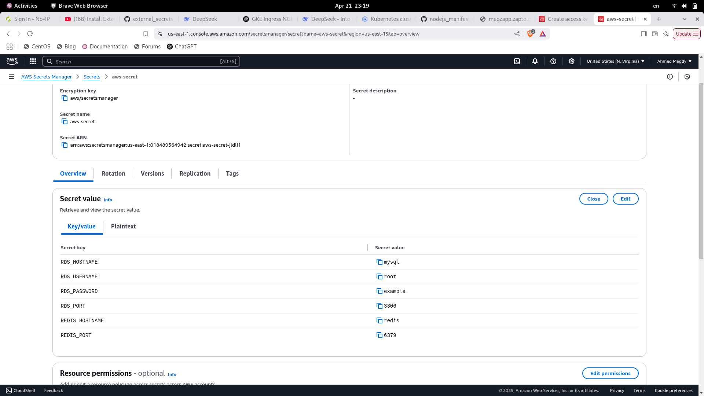

## create gke cluster
## gcloud container clusters get-credentials my-cluster --zone=us-central1-a
## setup ingress nginx 
# Add the ingress-nginx Helm repo
helm repo add ingress-nginx https://kubernetes.github.io/ingress-nginx
helm repo update

# Install ingress-nginx
helm install ingress-nginx ingress-nginx/ingress-nginx \
  --namespace ingress-nginx \
  --create-namespace \
  --set controller.service.type=LoadBalancer

  ## get public ip dns 
  kubectl get svc -n ingress-nginx ingress-nginx-controller
  ## make dns 
  https://www.noip.com/login?ref_url=console
  
  ## 🔐 Enable HTTPS using Cert-Manager 
kubectl apply --validate=false -f https://github.com/cert-manager/cert-manager/releases/latest/download/cert-manager.yaml
 ##  Create ClusterIssuer (Let's Encrypt Staging or Prod)

 ## Update Ingress with TLS
 ## done

 ## for secrets in aws create aws secrets
 
 show this vedio : https://www.youtube.com/watch?v=UsbeJIg_1Jk
 ## only need to nstall external secrets operator via Helm
 helm repo add external-secrets https://charts.external-secrets.io

helm repo update

helm install external-secrets external-secrets/external-secrets

kubectl get pod -w
 ## you can add secretstore and externalsecret to yaml files of helm 
 ## i work on gce so secret_store need aws credentials 
